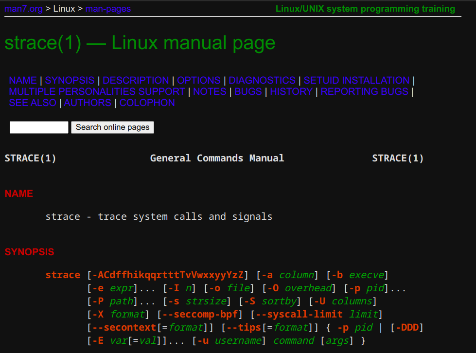

# Example

# Installation

Clone the repository and open your browser of choice

## Chromium based browsers

- Open your browser settings.
- Go to Extensions
- Activate the "Enable Developer Mode" toggle
- Use "Load unpacked" and point to the cloned repository

## Firefox

- Go to about:debugging
- Select "This Firefox"
- Click "Load Temporary Add-on..."

There are various workarounds to permanently install local 
extensions in Firefox that are beyond the scope of this README.
